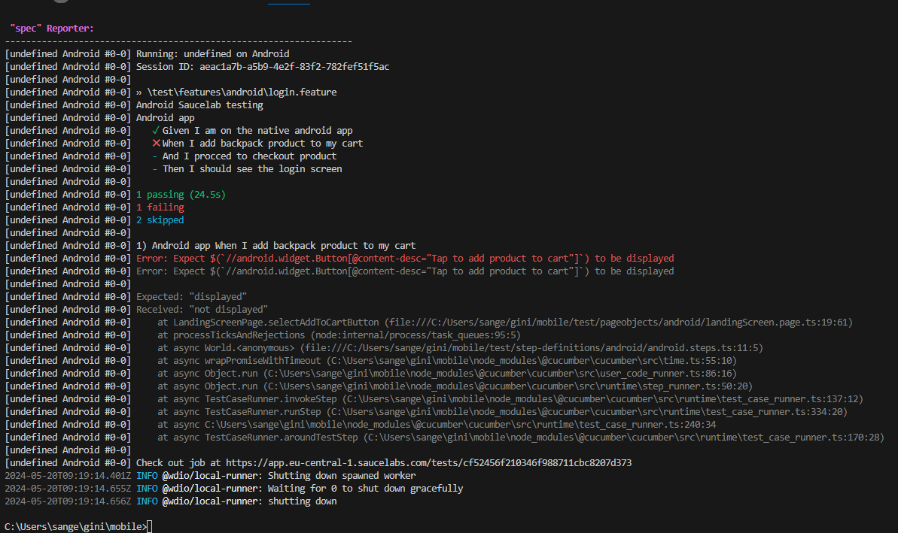

# Description: 
This framework aims to test functionality sauce lab demo native app (iOS/ Android) using webdriverio , appium javascript and cucumber BDD and sauce labs 

# Pre-requisites:
Download and install  
- node.js  v19.9.0  https://nodejs.org/en/download/
- npm version- v9.6.3( will be installed along with node)
- IDE of choice (VScode- https://code.visualstudio.com/download) 
- sauce lab sign in (SAUCE_USERNAME , SAUCE_ACCESS_KEY ) . Note - Saucelabs provides 60 mins of free automated test runs

# Usage:
From the command line terminal 
- git clone https://github.com/SangeethaEaswaran/native-app-testing
- cd native-app-testing
- npm install 
- update the SAUCE_USERNAME , SAUCE_ACCESS_KEY in local.env file 
- upload the .ipa and .apk files from /app folder to sauce lab app management as shown in the below screenshot 
- run tests using below CLI commands 
    - npm run iosTest 
    - npm run androidTest

# Reporting used :
Test results are viewed on terminal
1. Spec reporter : 

# Sauce labs 
- App management: Upload the apps to be tested here 
 
- Appium inspector: To find the elements for automation 

- Saucelabs Test results - Test runs and the logs can be seen here 
 
- Example Sauce lab mobile run videos can be seen under /sample-video-sauce folder in this framework
- capabilities - https://docs.saucelabs.com/dev/test-configuration-options/#mobile-appium-capabilities

# packages used
- @wdio/mocha-framework - A WebdriverIO plugin. Adapter for Mocha testing framework.
- cucumber- A tool for running automated tests written in plain language
- appium-uiautomator2-driver-  test automation framework for Android devices(emulators, real device)  automates native, hybrid and mobile web apps
- @types/node - This package contains type definitions for node 
- @wdio/sauce-service - A WebdriverIO service. It updates the job metadata ('name', 'passed', 'tags', 'public', 'build', 'custom-data') and runs Sauce Connect if desired
- @wdio/cli - WebdriverIO testrunner command line interface
- @wdio/cucumber-framework - A WebdriverIO plugin. Adapter for CucumberJS v5 testing framework.
- @wdio/local-runner - A WebdriverIO runner to run tests locally within worker processes
- @wdio/spec-reporter- A WebdriverIO plugin to report in spec style.
- appium - Appium is an open-source automation framework that provides WebDriver-based automation possibilities for a wide range of different mobile, desktop and IoT platforms
- ts-node - ts-node is a TypeScript execution engine and REPL for Node.js.
- typescript - adds optional types to JavaScript that support tools for large-scale JavaScript applications for any browser
- @wdio/allure-reporter A WebdriverIO reporter plugin to create Allure Test Reports.
- wdio-video-reporter  generates videos of your test executions